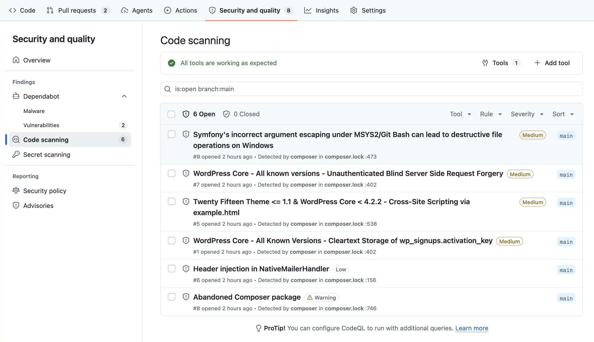
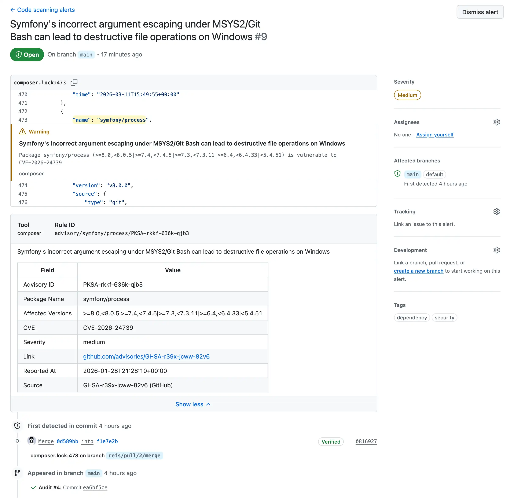
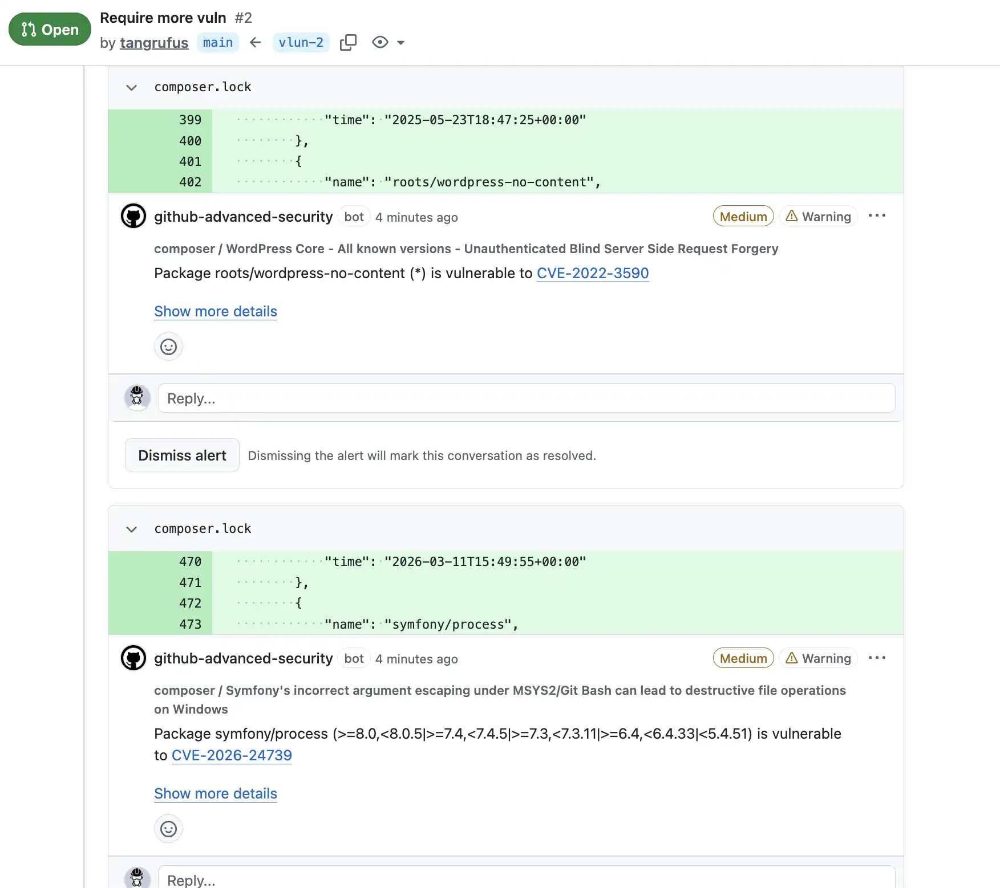
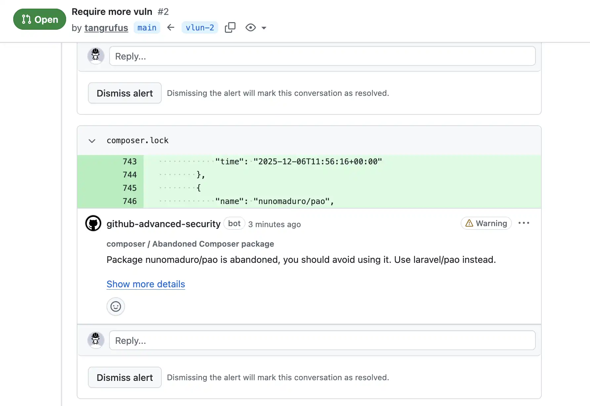

<div align="center">

# Composer Audit to SARIF Action

[](https://github.com/typisttech/composer-audit-to-sarif-action/releases/latest)
[](https://github.com/marketplace/actions/composer-audit-to-sarif)
[](https://github.com/typisttech/composer-audit-to-sarif-action/actions/workflows/test.yml)
[](https://github.com/typisttech/composer-audit-to-sarif-action/blob/master/LICENSE)
[](https://x.com/tangrufus)
[](https://bsky.app/profile/tangrufus.com)
[](https://github.com/sponsors/tangrufus)
[](https://typist.tech/contact/)

<p>
  <strong>Convert Composer audit reports to SARIF files</strong>
  <br>
  <br>
  Built with ♥ by <a href="https://typist.tech/">Typist Tech</a>
</p>

</div>

---

> [!TIP]
> **Hire Tang Rufus!**
>
> I am looking for my next role, freelance or full-time.
> If you find this tool useful, I can build you more dev tools like this.
> Let's talk if you are hiring PHP / Ruby / Go developers.
>
> Contact me at https://typist.tech/contact/

---

## Gallery

<details open>
  <summary>Code scanning alerts</summary>

  
</details>

<details>
  <summary>Code scanning alert details</summary>

  
</details>

<details>
  <summary>Inline advisory pull request comment</summary>

  
</details>

<details>
  <summary>Inline abandonment pull request comment</summary>

  
</details>

## Usage

See [action.yml](action.yml) and the underlying script [`ComSARIF`](https://github.com/typisttech/comsarif/#options).

```yaml
  - uses: typisttech/composer-audit-to-sarif-action@v0
    with:
      # Path to audit JSON file
      #
      # Default: audit.json
      audit: some/path/to/audit.json

      # Path to composer.lock
      #
      # Default: composer.lock
      lock: some/path/to/composer.lock

      # Path to repository root
      #
      # Default: ${{ github.workspace }}
      root: some/path

      # Version of [ComSARIF] to use. Leave blank for latest. For example: v1.0.2
      #
      # [ComSARIF]: https://github.com/typisttech/comsarif
      #
      # Default: ''
      version: v1.0.2

      # Whether to verify ComSARIF tarball attestation.
      #
      # Default: true
      verify-attestation: false

      # GitHub token for authentication
      #
      # Default: ${{ github.token }}
      github-token: ${{ secrets.GITHUB_PAT_TOKEN }}
```

### Outputs

| Key | Description | Example |
| --- | --- | --- |
| `sarif`  | Path to the SARIF file | `/tmp/comsarif-123.sarif` |

> [!TIP]
> **Hire Tang Rufus!**
>
> There is no need to understand any of these quirks.
> Let me handle them for you.
> I am seeking my next job, freelance or full-time.
>
> If you are hiring PHP / Ruby / Go developers,
> contact me at https://typist.tech/contact/

## Examples

### Audit based on the lock file instead of the installed packages

```yaml
name: Audit

on:
  workflow_dispatch:
  schedule:
    - cron: '0 9 * * *' # Daily
  pull_request:
    branches:
      - main
  push:
    branches:
      - main

permissions:
  # Required for all workflows
  security-events: write
  # Required for private repositories
  actions: read
  contents: read

jobs:
  composer-audit:
    runs-on: ubuntu-latest
    steps:
      - uses: actions/checkout@v6
        with:
          persist-credentials: false
          sparse-checkout: |
            composer.json
            composer.lock

      - uses: shivammathur/setup-php@v2
        with:
          php-version: '8.5'
          coverage: none

      - run: composer audit --locked --format json > audit.json
        continue-on-error: true

      - uses: typisttech/composer-audit-to-sarif-action@v0
        id: comsarif
        with:
          audit: audit.json

      - uses: github/codeql-action/upload-sarif@v4
        with:
          sarif_file: ${{ steps.comsarif.outputs.sarif }}
```

### Audit based on installed packages

> [!TIP]
> `composer install` is essential to [`typisttech/wp-org-closed-plugin`](https://github.com/typisttech/wp-org-closed-plugin).


```diff
        - uses: shivammathur/setup-php@v2
          with:
            php-version: '8.5'
            coverage: none

+       - run: composer install
+
+       - run: composer audit --format json > audit.json
-       - run: composer audit --locked --format json > audit.json
          continue-on-error: true

        - uses: typisttech/composer-audit-to-sarif-action@v0
          id: comsarif
          with:
            audit: audit.json

        - uses: github/codeql-action/upload-sarif@v4
          with:
            sarif_file: ${{ steps.comsarif.outputs.sarif }}
```

## People Also Use

- [`ComSARIF`](https://github.com/typisttech/comsarif/)
  CLI to convert Composer audit reports to SARIF files
- [PHP Matrix Action](https://github.com/typisttech/php-matrix-action)
  Generate PHP version matrix according to `composer.json` for GitHub Actions
- [WP Sec Adv](https://github.com/typisttech/wpsecadv)
  Composer repository for WordPress security advisories
- [WP Org Closed Plugin](https://github.com/typisttech/wp-org-closed-plugin)
  Composer plugin to mark packages as abandoned if closed on WordPress.org

## Credits

[`Composer Audit to SARIF Action`](https://github.com/typisttech/composer-audit-to-sarif-action) is a [Typist Tech](https://typist.tech) project and
maintained by [Tang Rufus](https://x.com/TangRufus), freelance developer [for hire](https://typist.tech/contact/).

Full list of contributors can be found [on GitHub](https://github.com/typisttech/composer-audit-to-sarif-action/graphs/contributors).

## Copyright and License

This project is a [free software](https://www.gnu.org/philosophy/free-sw.en.html) distributed under the terms of
the MIT license. For the full license, see [LICENSE](LICENSE).

## Contribute

Feedbacks / bug reports / pull requests are welcome.
